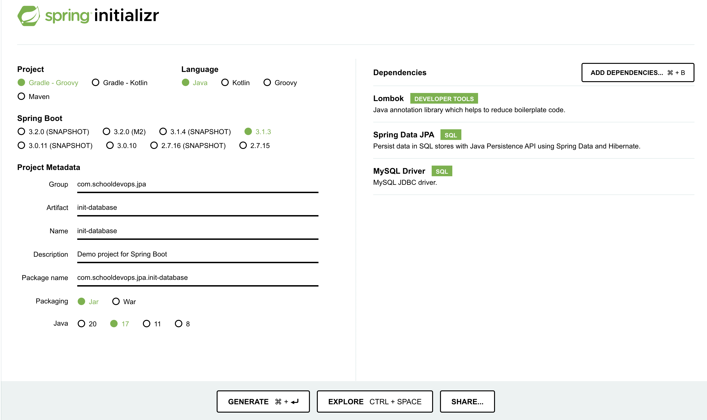

# SpringBoot 데이터베이스 자동 초기화 

- 가끔 프로그램을 개발할때 데이터베이스 생성, 테이블생성, 데이터 인서트등을 초기에 수행해야하는 경우가 있다. 
- 이때 SpringBoot + Spring Data JPA를 이용하면 쉽게 초기 DDL과 DML을 수행할 수 있다. 

## 스프링 부트 어플리케이션 준비하기

- https://start.spring.io 에 접속하여 다음과 같이 프로젝트를 생성하자. 



## Mysql docker-compose로 인스턴스 올리기

- 우선 Mysql을 이용할 것이고, mysql 서버 설치가 필요하다. 
- 우리는 여기서 간단하게 docker-compose를 이용하여 mysql을 설치할 것이다. 

- docker-compose.yaml 파일을 생성하고 다음과 같이 작성하자. 

```yaml
version: '3.7'
services:
  mysql:
    image: mysql:latest
    platform: linux/arm64
    restart: always
    volumes:
      - ./db/mysql/data:/var/lib/mysql
      - ./db/mysql/init:/docker-entrypoint-initdb.d
    ports:
      - '3306:3306'
    environment:
      MYSQL_ROOT_PASSWORD: root1234
      MYSQL_DATABASE: myDb
      MYSQL_USER: testuser
      MYSQL_PASSWORD: testuser1234
      TZ: Asia/Seoul
```

- docker-compose.yaml 파일의 내용은 다음과 같다. 
  - mysql-db: 서비스 이름이 된다. 
  - platform: mac m1 칩을 이용하는 경우라면 'linux/arm64' 를 지정한다. 그렇지 않다면 제거해도 된다. 
  - restart: always 는 인스턴스가 내려가면 자동으로 재 시작 하라는 의미가 된다. 
  - volumes: 볼륨을 지정한다. <호스트볼륨>:<컨테이너내부 볼륨> 을 의미한다. 
  - ports: 포트를 지정한다. <호스트 포트>:<컨테이너 내부 포트> 을 의미한다. 
  - environment: 환경 변수를 지정한다. 
    - MYSQL_ROOT_PASSWORD: 루트 계정 비밀번호를 지정한다.
    - MYSQL_DATABASE: 신규 생성할 데이터베이스
    - MYSQL_USER: 데이터베이스 접근 사용자 계정
    - MYSQL_PASSWORD: 데이터베이스 접근 비밀번호 
    - TZ: 타임존을 지정한다

## 데이터소스 환경 설정하기 

- 데이터베이스의 데이터소스 환경 설정을 수행하자. 
- application.yaml 파일에 다음 내용을 추가하자. 

```yaml
spring:
  sql:
    init:
      platform: mysql
      mode: always
  datasource:
    driver-class-name: com.mysql.cj.jdbc.Driver
    url: jdbc:mysql://localhost:3306/myDb?serverTimezone=UTC&characterEncoding=UTF-8
    username: testuser
    password: testuser1234
  jpa:
    properties:
      hibernate:
        dialect: org.hibernate.dialect.MySQL57Dialect
        format_sql: true
    generate-ddl: true
    hibernate:
      ddl-auto: none
    show-sql: true
    #    defer-datasource-initialization: true
    database-platform: org.hibernate.dialect.MySQL57Dialect
```

## DDL 수행 자동화 

- DDL 은 데이터베이스 생성이나, 테이블 생성을 위한 쿼리 파일이다. 
- resources/schema.sql 파일을 생성하고 다음과 같이 작성한다. 

```sql
CREATE TABLE IF NOT EXISTS myDb.pet (
    name VARCHAR(20),
    owner VARCHAR(20),
    species VARCHAR(20),
    sex CHAR(1),
    birth DATE,
    death DATE
    );
```

- CREATE TABLE 구문은 테이블을 생성한다. 
- IF NOT EXISTS 구문은 테이블이 존재하지 않는경우 테이블을 생성한다. 
- 위 쿼리는 스프링부트가 기동될때 생성하고자 하는 테이블 스키마 정보이다. 

### 환경설정

- 자동 DML 수행을 위한 환경 설정은 다음과 같다. 

```yaml
spring:
  jpa:
    generate-ddl: true
    hibernate:
      ddl-auto: none
```

- 위와 같이 generate-ddl 값을 true로 설정하면 자동으로 테이블 생성등의 DDL 작업을 수행한다.
- hibernate.ddl-auto 값은 다음과 같이 지정이 가능하다. 
  - create: 기존 테이블을 삭제하고 다시 생성한다. 
  - create-drop: create와 동일하나, 종료 시점에 테이블을 제거한다. 
  - upate: 변경부분만 반영한다. 
  - validate: 엔터티와 테이블이 정상 매핑된 것인지만 확인한다. 
  - none: 엔터티를 통한 자동생성을 사용하지 않고, schema.sql 파일이 있는경우 해당 파일을 사용한다. 

## DML 수행 자동화 

- DML을 수행할 쿼리를 작성하자. 
- resources/data.sql 파일을 생성하고 다음 내용을 추가하자. 

```sql
INSERT INTO example.pet
    VALUES ('Puffball1','Diane1','hamster','f','1999-03-30',NULL);
INSERT INTO example.pet
    VALUES ('Puffball2','Diane2','hamster2','m','1999-03-30',NULL);
```

- 위 코드는 우리가 생성한 테이블에 2개의 row를 생성한다. 

### 환경 설정 

- 이제 자동 DML을 위한 환경 설정 부분을 알아보자. 

```yaml
spring:
  sql:
    init:
      platform: mysql
      mode: always
```

- spring.sql.init.platform: mysql 과 같이 사용할 데이터베이스 플랫폼을 기술한다. 
- spring.sql.init.mode: always 는 매번 부트업 되는 경우 초기화를 수행한다.
- 기본적으로 스프링부트는 data.sql파일을 읽어서 데이터베이스 초기화를 수행한다. 

## 확인하기 

- 생성 확인을 위해서는 application을 실행하자. 

```shell
./gradle clean build boot:run
```

- 위 코드로 실행하거나, IDE를 이용하여 코드를 실행하자. 

### 데이터베이스 생성 확인하기 


- 위와 같이 우리가 원하는 테이블 Pet이 생성되었음을 확인할 수 있다. 


- 역시 데이터도 입력되어 있음을 확인할 수 있다. 

## WrapUp

- 스프링부트와 SpringData JPA를 이용하여 스프링부트가 올라올때 자동으로 테이블을 생성하고, 데이터를 입력할 수 있다. 
- 개발 환경 설정을 쉽게 수행하거나, 자동으로 어려움없이 소스 저장소에서 클론하여 환경을 구성할때 매우 편리한 방법이다. 
- 중요한것은 개발 환경에서 사용하기 편리하지만, 실제 프러덕 환경에서는 동작하지 않도록 주의해야한다. 
- 가능하면 application-{evn}.yaml 등을 별도로 지정해서 개발환경/스테이지환경/프러덕환경 등을 분리하여 실수하지 않도록 자동화할 필요가 있다. 


